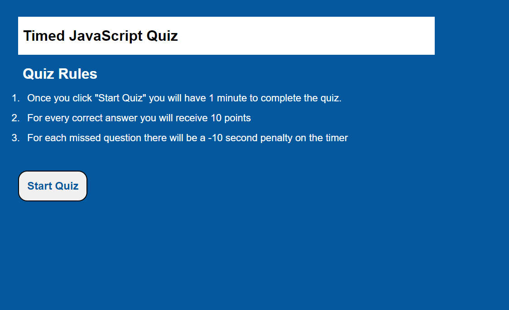

# Title: JavaScript Coding Quiz Application 

## Description: 
In this project I used JavaScript to develop a timed multiple-choice quiz application. The application features a countdown timer and a score system that stores and displays the users current score and highest score upon completion. It will also penalize users for incorrect answers by subtracting 10 seconds from the timer for each missed question.

## 

## Link to Deployed Application: 
[click here](https://ccarroll929.github.io/coding-quiz/) 

## Installation: 
[Visual Studio Code](https://code.visualstudio.com/download)
[Git for Windows](https://gitforwindows.org/)